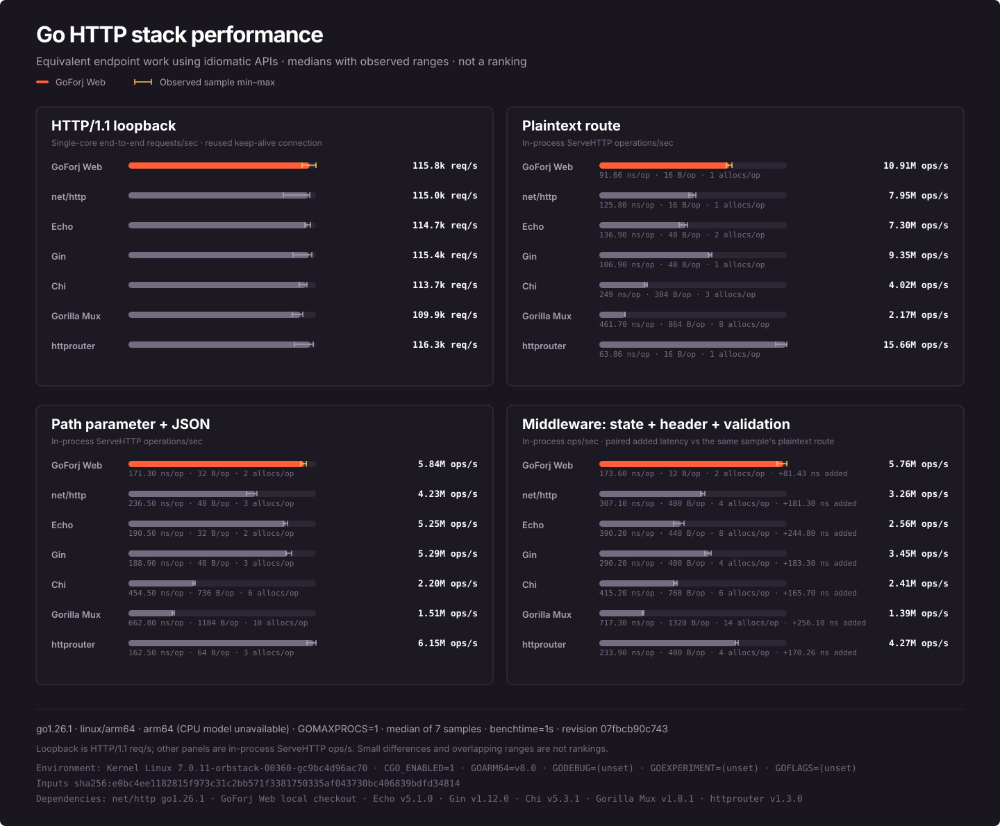

<p align="center">
  
</p>

<p align="center">
  App-facing HTTP contracts with an Echo-backed runtime for GoForj applications.
</p>

<p align="center">
  <a href="https://pkg.go.dev/github.com/goforj/web"></a>
  <a href="LICENSE"></a>
  <a href="https://github.com/goforj/web/actions/workflows/ci.yml"></a>
  <a href="https://go.dev"></a>
  <a href="https://github.com/goforj/web/releases"></a>
  <a href="https://codecov.io/gh/goforj/web"></a>
</p>

`web` keeps application handlers behind focused `Context`, `Router`, and middleware contracts while Echo stays at the HTTP boundary. It includes an Echo adapter, route declarations, common middleware, WebSockets, Prometheus instrumentation, handler test helpers, and source-aware route and OpenAPI indexing.

The contracts deliberately expose less than Echo. Applications can stay on the smaller surface for ordinary HTTP work and use explicit Echo escape hatches when an integration needs the underlying engine or context.

## Installation

Requires Go 1.25 or newer.

```sh
go get github.com/goforj/web
```

## Quick start

```go
package main

import (
	"fmt"
	"log"
	"net/http"

	"github.com/goforj/web"
	"github.com/goforj/web/adapter/echoweb"
	"github.com/goforj/web/webmiddleware"
)

func main() {
	adapter := echoweb.New()
	router := adapter.Router()

	router.Use(
		webmiddleware.Recover(),
		webmiddleware.RequestID(),
	)

	router.GET("/healthz", func(c web.Context) error {
		return c.Text(http.StatusOK, "ok")
	})

	router.GET("/users/:id", func(c web.Context) error {
		id := c.Param("id")
		return c.JSON(http.StatusOK, map[string]any{
			"id":   id,
			"name": fmt.Sprintf("user-%s", id),
		})
	})

	log.Fatal(http.ListenAndServe(":8080", adapter))
}
```

Start the server with `go run .`, then make requests from another shell:

```console
$ curl -s http://localhost:8080/healthz
ok
$ curl -s http://localhost:8080/users/42
{"id":"42","name":"user-42"}
```

The quick start owns the `http.Server` directly to keep the first example small. For cancellation-aware graceful shutdown, use [`echoweb.NewServer`](#graceful-server-lifecycle).

## Choose an entry point

| Start with | Use it when |
| --- | --- |
| `echoweb.New()` and `router.GET(...)` | Routes are registered directly and your application owns the `http.Server`. |
| `web.NewRouteGroup(...)` and `web.RegisterRoutes(...)` | Routes should be reusable declarations for reporting, indexing, or generated application composition. |
| `echoweb.NewServer(...)` | The adapter should register route groups and own graceful HTTP shutdown. |
| `echoweb.Wrap(engine)` | An existing Echo engine needs to expose the app-facing `web.Router` contract. |

## Package map

| Package | Purpose |
| --- | --- |
| [`web`](https://pkg.go.dev/github.com/goforj/web) | Handler, context, router, route declaration, WebSocket, and route-reporting contracts. |
| [`adapter/echoweb`](https://pkg.go.dev/github.com/goforj/web/adapter/echoweb) | Echo adapter, native escape hatches, and server lifecycle. |
| [`webmiddleware`](https://pkg.go.dev/github.com/goforj/web/webmiddleware) | Authentication, security, routing, payload, compression, timeout, proxy, and rate-limit middleware. |
| [`webprometheus`](https://pkg.go.dev/github.com/goforj/web/webprometheus) | HTTP metrics middleware, scrape handlers, and Pushgateway support. |
| [`webindex`](https://pkg.go.dev/github.com/goforj/web/webindex) | Source-aware route manifests, diagnostics, schemas, and OpenAPI documents. |
| [`webtest`](https://pkg.go.dev/github.com/goforj/web/webtest) | Lightweight contexts for isolated handler tests. |

## Common workflows

The quick start above is a complete program. The following recipes are focused excerpts; complete generated programs are available in [`examples`](examples).

### Declarative route groups

Route values keep registration data available for route reporting and source-aware tooling instead of burying every route in adapter calls.

```go
adapter := echoweb.New()

routes := []web.Route{
	web.NewRoute(http.MethodGet, "/healthz", func(c web.Context) error {
		return c.NoContent(http.StatusNoContent)
	}),
	web.NewRoute(http.MethodGet, "/users", func(c web.Context) error {
		return c.JSON(http.StatusOK, []map[string]any{{"id": 1}})
	}),
}

group := web.NewRouteGroup("/api", routes)
if err := web.RegisterRoutes(adapter.Router(), []web.RouteGroup{group}); err != nil {
	log.Fatal(err)
}
```

### Middleware phases

Use `Pre` for middleware that must change the request method or path before route matching. Method override, rewrite, and trailing-slash middleware belong in this phase. Use `Use` for middleware that wraps the matched request handler.

```go
router := echoweb.New().Router()

router.Pre(
	webmiddleware.MethodOverride(),
	webmiddleware.RemoveTrailingSlash(),
)

store := webmiddleware.NewRateLimiterMemoryStore(rate.Every(time.Second))
router.Use(
	webmiddleware.Recover(),
	webmiddleware.RequestID(),
	webmiddleware.RateLimiter(store),
)
```

Middleware runs in registration order, so put recovery and request identity near the outside of the chain and keep a shared rate-limit store for the lifetime of the application.

### Graceful server lifecycle

`Server.Serve` listens until its context is cancelled, then shuts down with the configured timeout.

```go
ctx, stop := signal.NotifyContext(context.Background(), os.Interrupt, syscall.SIGTERM)
defer stop()

server, err := echoweb.NewServer(echoweb.ServerConfig{
	Addr: ":8080",
	RouteGroups: []web.RouteGroup{
		web.NewRouteGroup("/api", []web.Route{
			web.NewRoute(http.MethodGet, "/healthz", func(c web.Context) error {
				return c.NoContent(http.StatusNoContent)
			}),
		}),
	},
	ShutdownTimeout: 10 * time.Second,
})
if err != nil {
	log.Fatal(err)
}
if err := server.Serve(ctx); err != nil {
	log.Fatal(err)
}
```

### Test a handler

`webtest.NewContext` runs an isolated handler without booting a router or listener. Use the Echo adapter with `httptest` when the route mapping itself is part of the behavior under test.

```go
func TestHealthHandler(t *testing.T) {
	req := httptest.NewRequest(http.MethodGet, "/healthz", nil)
	rec := httptest.NewRecorder()
	ctx := webtest.NewContext(req, rec, "/healthz", nil)

	handler := func(c web.Context) error {
		return c.Text(http.StatusOK, "ok")
	}
	if err := handler(ctx); err != nil {
		t.Fatal(err)
	}
	if rec.Code != http.StatusOK {
		t.Fatalf("expected %d, got %d", http.StatusOK, rec.Code)
	}
	if rec.Body.String() != "ok" {
		t.Fatalf("expected ok, got %q", rec.Body.String())
	}
}
```

### Expose Prometheus metrics

Use one metrics instance for both middleware and scraping. An explicit registry keeps collector ownership local to the application.

```go
registry := prometheus.NewRegistry()
metrics := webprometheus.MustNew(webprometheus.Config{
	Namespace:  "app",
	Registerer: registry,
	Gatherer:   registry,
})

router := echoweb.New().Router()
router.Use(metrics.Middleware())
router.GET("/metrics", metrics.Handler())
router.GET("/users", func(c web.Context) error {
	return c.JSON(http.StatusOK, []map[string]any{{"id": 1}})
})
```

### Generate a route manifest and OpenAPI document

Set `RouteCompositionPath` to the source file that assembles the application route groups. Scoping the index to that composition keeps unrelated fixtures and unused providers out of the published contract.

```go
manifest, err := webindex.RunCached(context.Background(), webindex.IndexOptions{
	Root:                 ".",
	RouteCompositionPath: "internal/http/routes.go",
	OutPath:              "build/webindex.json",
	DiagnosticsPath:      "build/webindex.diagnostics.json",
	OpenAPIPath:           "build/openapi.json",
	Strict:                true,
}, "build/webindex.cache")
if err != nil {
	log.Fatal(err)
}
log.Printf("indexed %d operations", len(manifest.Operations))
```

`RunCached` reuses a content-validated analysis snapshot while artifact publication remains changed-only; use `Run` when persistent caching is unnecessary. `Strict` promotes unresolved source evidence into an error instead of publishing an ambiguous contract. The returned manifest still contains structured diagnostics for reporting.

### Add a WebSocket route

WebSocket handlers use the same app-facing context plus a small connection contract.

```go
router := echoweb.New().Router()
router.GETWS("/ws", func(c web.Context, conn web.WebSocketConn) error {
	var message map[string]any
	if err := conn.ReadJSON(&message); err != nil {
		return err
	}
	return conn.WriteJSON(map[string]any{"echo": message})
})
```

## Echo escape hatches

Use [`echoweb.Wrap`](https://pkg.go.dev/github.com/goforj/web/adapter/echoweb#Wrap) to adapt an existing Echo engine. `Adapter.Echo`, `echoweb.UnwrapContext`, and `Context.Native` expose the underlying implementation when a framework-specific integration genuinely needs it.

If an application only needs Echo and benefits from its full native API everywhere, using Echo directly is reasonable. `web` earns its place when the smaller handler contract, route declarations, shared middleware surface, testing helpers, metrics, or source-aware indexing are useful application boundaries.

## Client IP trust

For backward compatibility, the Echo adapter initializes Echo's legacy IP extractor when an engine does not already have one. That extractor trusts forwarding headers without proxy checks, so configure it deliberately before using `Context.RealIP` for security, rate limiting, or auditing.

For a server reached directly by clients, use the network peer address:

```go
adapter := echoweb.New()
adapter.Echo().IPExtractor = echo.ExtractIPDirect()
```

Behind a trusted proxy, configure `echo.ExtractIPFromXFFHeader` or `echo.ExtractIPFromRealIPHeader` with trust options that match the deployment, and ensure the edge proxy removes client-supplied forwarding headers before adding its own.

## Performance

<!-- bench:embed:start -->
<p align="center">
  
</p>

Whiskers in every panel show the observed sample minimum and maximum. The first panel measures single-core HTTP/1.1 loopback requests per second over a reused connection. The other panels measure in-process `ServeHTTP` operations per second, and their allocation figures cover the complete route and handler dispatch. Middleware details show the median paired latency added above the plaintext route measured in the same benchmark process. Each primary value is the median of 7 samples at `1s` with `GOMAXPROCS=1`.

Bars are scaled independently within each panel, and small differences should not be treated as rankings. These are microbenchmarks and loopback ceilings, not production capacity forecasts.

Measured with `go1.26.1` on `linux/arm64` (arm64 (CPU model unavailable)), kernel `Linux 7.0.11-orbstack-00360-gc9bc4d96ac70`, revision `07fbcb90c743`. Build settings: `CGO_ENABLED=1`, `GOARM64=v8.0`, `GODEBUG=(unset)`, `GOEXPERIMENT=(unset)`, `GOFLAGS=(unset)`. Benchmark inputs: `sha256:e0bc4ee1182815f973c31c2bb571f3381750335af043730bc406839bdfd34814`. Dependencies: net/http go1.26.1, GoForj Web local checkout, Echo v5.1.0, Gin v1.12.0, Chi v5.3.1, Gorilla Mux v1.8.1, httprouter v1.3.0.

Fiber is omitted because its `fasthttp` engine is not directly comparable in this shared `net/http` suite. See the [benchmark methodology](docs/bench/README.md) and [recorded sample rows](docs/bench/benchmarks_rows.json).

Regenerate the measurement and image with:

```sh
make benchmark-svg
```
<!-- bench:embed:end -->

## API

<!-- api:embed:start -->
## API Index

| Group | Functions |
|------:|:-----------|
| **Adapter** | [Adapter.Echo](#echoweb-adapter-echo) · [Adapter.Router](#echoweb-adapter-router) · [Adapter.ServeHTTP](#echoweb-adapter-servehttp) · [New](#echoweb-new) · [NewServer](#echoweb-newserver) · [Server.Router](#echoweb-server-router) · [Server.Serve](#echoweb-server-serve) · [Server.ServeHTTP](#echoweb-server-servehttp) · [UnwrapContext](#echoweb-unwrapcontext) · [UnwrapWebSocketConn](#echoweb-unwrapwebsocketconn) · [Wrap](#echoweb-wrap) |
| **Indexing** | [Run](#webindex-run) · [RunCached](#webindex-runcached) |
| **Middleware<br>Auth** | [BasicAuth](#webmiddleware-basicauth) · [BasicAuthWithConfig](#webmiddleware-basicauthwithconfig) · [CSRF](#webmiddleware-csrf) · [CSRFWithConfig](#webmiddleware-csrfwithconfig) · [CreateExtractors](#webmiddleware-createextractors) · [KeyAuth](#webmiddleware-keyauth) · [KeyAuthWithConfig](#webmiddleware-keyauthwithconfig) |
| **Middleware<br>Compression** | [Compress](#webmiddleware-compress) · [Decompress](#webmiddleware-decompress) · [DecompressWithConfig](#webmiddleware-decompresswithconfig) · [Gzip](#webmiddleware-gzip) · [GzipWithConfig](#webmiddleware-gzipwithconfig) |
| **Middleware<br>Method Override** | [MethodFromForm](#webmiddleware-methodfromform) · [MethodFromHeader](#webmiddleware-methodfromheader) · [MethodFromQuery](#webmiddleware-methodfromquery) · [MethodOverride](#webmiddleware-methodoverride) · [MethodOverrideWithConfig](#webmiddleware-methodoverridewithconfig) |
| **Middleware<br>Path Rewriting** | [AddTrailingSlash](#webmiddleware-addtrailingslash) · [AddTrailingSlashWithConfig](#webmiddleware-addtrailingslashwithconfig) · [RemoveTrailingSlash](#webmiddleware-removetrailingslash) · [RemoveTrailingSlashWithConfig](#webmiddleware-removetrailingslashwithconfig) · [Rewrite](#webmiddleware-rewrite) · [RewriteWithConfig](#webmiddleware-rewritewithconfig) |
| **Middleware<br>Payloads** | [BodyDump](#webmiddleware-bodydump) · [BodyDumpWithConfig](#webmiddleware-bodydumpwithconfig) · [BodyLimit](#webmiddleware-bodylimit) · [BodyLimitWithConfig](#webmiddleware-bodylimitwithconfig) · [ErrorBodyDump](#webmiddleware-errorbodydump) · [ErrorBodyDumpWithConfig](#webmiddleware-errorbodydumpwithconfig) |
| **Middleware<br>Proxying** | [NewRandomBalancer](#webmiddleware-newrandombalancer) · [NewRoundRobinBalancer](#webmiddleware-newroundrobinbalancer) · [Proxy](#webmiddleware-proxy) · [ProxyWithConfig](#webmiddleware-proxywithconfig) |
| **Middleware<br>Rate Limiting** | [NewRateLimiterMemoryStore](#webmiddleware-newratelimitermemorystore) · [NewRateLimiterMemoryStoreWithConfig](#webmiddleware-newratelimitermemorystorewithconfig) · [RateLimiter](#webmiddleware-ratelimiter) · [RateLimiterMemoryStore.Allow](#webmiddleware-ratelimitermemorystore-allow) · [RateLimiterWithConfig](#webmiddleware-ratelimiterwithconfig) |
| **Middleware<br>Redirects** | [HTTPSNonWWWRedirect](#webmiddleware-httpsnonwwwredirect) · [HTTPSNonWWWRedirectWithConfig](#webmiddleware-httpsnonwwwredirectwithconfig) · [HTTPSRedirect](#webmiddleware-httpsredirect) · [HTTPSRedirectWithConfig](#webmiddleware-httpsredirectwithconfig) · [HTTPSWWWRedirect](#webmiddleware-httpswwwredirect) · [HTTPSWWWRedirectWithConfig](#webmiddleware-httpswwwredirectwithconfig) · [NonWWWRedirect](#webmiddleware-nonwwwredirect) · [NonWWWRedirectWithConfig](#webmiddleware-nonwwwredirectwithconfig) · [WWWRedirect](#webmiddleware-wwwredirect) · [WWWRedirectWithConfig](#webmiddleware-wwwredirectwithconfig) |
| **Middleware<br>Reliability** | [Recover](#webmiddleware-recover) · [RecoverWithConfig](#webmiddleware-recoverwithconfig) |
| **Middleware<br>Request Lifecycle** | [ContextTimeout](#webmiddleware-contexttimeout) · [ContextTimeoutWithConfig](#webmiddleware-contexttimeoutwithconfig) · [DefaultSkipper](#webmiddleware-defaultskipper) · [RequestID](#webmiddleware-requestid) · [RequestIDWithConfig](#webmiddleware-requestidwithconfig) · [RequestLoggerWithConfig](#webmiddleware-requestloggerwithconfig) · [Timeout](#webmiddleware-timeout) · [TimeoutWithConfig](#webmiddleware-timeoutwithconfig) |
| **Middleware<br>Security** | [CORS](#webmiddleware-cors) · [CORSWithConfig](#webmiddleware-corswithconfig) · [Secure](#webmiddleware-secure) · [SecureWithConfig](#webmiddleware-securewithconfig) |
| **Middleware<br>Static Files** | [Static](#webmiddleware-static) · [StaticWithConfig](#webmiddleware-staticwithconfig) |
| **Prometheus** | [Default](#webprometheus-default) · [Handler](#webprometheus-handler) · [Metrics.Handler](#webprometheus-metrics-handler) · [Metrics.Middleware](#webprometheus-metrics-middleware) · [Middleware](#webprometheus-middleware) · [MustNew](#webprometheus-mustnew) · [New](#webprometheus-new) · [RunPushGatewayGatherer](#webprometheus-runpushgatewaygatherer) · [WriteGatheredMetrics](#webprometheus-writegatheredmetrics) |
| **Route Reporting** | [BuildRouteEntries](#buildrouteentries) · [RenderRouteTable](#renderroutetable) |
| **Routing** | [MountRouter](#mountrouter) · [NewRoute](#newroute) · [NewRouteGroup](#newroutegroup) · [NewWebSocketRoute](#newwebsocketroute) · [RegisterRoutes](#registerroutes) · [Route.Handler](#route-handler) · [Route.HandlerName](#route-handlername) · [Route.IsWebSocket](#route-iswebsocket) · [Route.Method](#route-method) · [Route.MiddlewareNames](#route-middlewarenames) · [Route.Middlewares](#route-middlewares) · [Route.Path](#route-path) · [Route.WebSocketHandler](#route-websockethandler) · [Route.WithMiddlewareNames](#route-withmiddlewarenames) · [RouteGroup.MiddlewareNames](#routegroup-middlewarenames) · [RouteGroup.Middlewares](#routegroup-middlewares) · [RouteGroup.RoutePrefix](#routegroup-routeprefix) · [RouteGroup.Routes](#routegroup-routes) · [RouteGroup.WithMiddlewareNames](#routegroup-withmiddlewarenames) |
| **Testing** | [NewContext](#webtest-newcontext) |


## API Reference

_Generated from public API comments and examples._

### Adapter

#### <a id="echoweb-adapter-echo"></a>echoweb.Adapter.Echo

Echo returns the underlying Echo engine.

```go
adapter := echoweb.New()
fmt.Println(adapter.Echo() != nil)
// true
```

#### <a id="echoweb-adapter-router"></a>echoweb.Adapter.Router

Router returns the app-facing router contract.

```go
adapter := echoweb.New()
fmt.Println(adapter.Router() != nil)
// true
```

#### <a id="echoweb-adapter-servehttp"></a>echoweb.Adapter.ServeHTTP

ServeHTTP exposes the adapter as a standard http.Handler.

```go
adapter := echoweb.New()
adapter.Router().GET("/healthz", func(c web.Context) error { return c.NoContent(http.StatusNoContent) })
rr := httptest.NewRecorder()
req := httptest.NewRequest(http.MethodGet, "/healthz", nil)
adapter.ServeHTTP(rr, req)
fmt.Println(rr.Code)
// 204
```

#### <a id="echoweb-new"></a>echoweb.New

New creates a new Echo-backed web adapter.

```go
adapter := echoweb.New()
fmt.Println(adapter.Router() != nil, adapter.Echo() != nil)
// true true
```

#### <a id="echoweb-newserver"></a>echoweb.NewServer

NewServer creates an Echo-backed server from web route groups and mounts.

```go
server, err := echoweb.NewServer(echoweb.ServerConfig{
	RouteGroups: []web.RouteGroup{
		web.NewRouteGroup("/api", []web.Route{
			web.NewRoute(http.MethodGet, "/healthz", func(c web.Context) error { return c.NoContent(http.StatusNoContent) }),
		}),
	},
})

fmt.Println(err == nil, server.Router() != nil)
// true true
```

#### <a id="echoweb-server-router"></a>echoweb.Server.Router

Router exposes the app-facing router contract.

```go
server, _ := echoweb.NewServer(echoweb.ServerConfig{})
fmt.Println(server.Router() != nil)
// true
```

#### <a id="echoweb-server-serve"></a>echoweb.Server.Serve

Serve starts the server and gracefully shuts it down when ctx is cancelled.

```go
server, _ := echoweb.NewServer(echoweb.ServerConfig{Addr: "127.0.0.1:0"})
ctx, cancel := context.WithCancel(context.Background())
cancel()
fmt.Println(server.Serve(ctx) == nil)
// true
```

#### <a id="echoweb-server-servehttp"></a>echoweb.Server.ServeHTTP

ServeHTTP exposes the server as an http.Handler for tests and local probing.

```go
server, _ := echoweb.NewServer(echoweb.ServerConfig{
	RouteGroups: []web.RouteGroup{
		web.NewRouteGroup("/api", []web.Route{
			web.NewRoute(http.MethodGet, "/healthz", func(c web.Context) error { return c.NoContent(http.StatusNoContent) }),
		}),
	},
})

rr := httptest.NewRecorder()
req := httptest.NewRequest(http.MethodGet, "/api/healthz", nil)
server.ServeHTTP(rr, req)
fmt.Println(rr.Code)
// 204
```

#### <a id="echoweb-unwrapcontext"></a>echoweb.UnwrapContext

UnwrapContext returns the underlying Echo context when the web.Context came from this adapter.

```go
adapter := echoweb.New()

adapter.Router().GET("/healthz", func(c web.Context) error {
	_, ok := echoweb.UnwrapContext(c)
	fmt.Println(ok)
	return c.NoContent(http.StatusOK)
})

rr := httptest.NewRecorder()
req := httptest.NewRequest(http.MethodGet, "/healthz", nil)
adapter.ServeHTTP(rr, req)
// true
```

#### <a id="echoweb-unwrapwebsocketconn"></a>echoweb.UnwrapWebSocketConn

UnwrapWebSocketConn returns the underlying gorilla websocket connection.

```go
_, ok := echoweb.UnwrapWebSocketConn(nil)
fmt.Println(ok)
// false
```

#### <a id="echoweb-wrap"></a>echoweb.Wrap

Wrap exposes an existing Echo engine through the web.Router contract.

```go
adapter := echoweb.Wrap(nil)
fmt.Println(adapter.Echo() != nil)
// true
```

### Indexing

#### <a id="webindex-run"></a>webindex.Run

Run indexes API metadata from source and writes artifacts.

```go
manifest, err := webindex.Run(context.Background(), webindex.IndexOptions{
	Root:    ".",
	OutPath: "webindex.json",
})

fmt.Println(err == nil, manifest.Version != "")
// true true
```

#### <a id="webindex-runcached"></a>webindex.RunCached

RunCached indexes API metadata while reusing a content-validated analysis cache at cachePath.
Relative cache paths resolve from opts.Root. An empty path behaves like Run.
When the active build cannot be fingerprinted safely, RunCached falls back to a full run without persisting state.

### Auth Middleware

#### <a id="webmiddleware-basicauth"></a>webmiddleware.BasicAuth

BasicAuth returns basic auth middleware.

```go
router := echoweb.New().Router()

router.Use(webmiddleware.BasicAuth(func(user, pass string, c web.Context) (bool, error) {
	return user == "demo" && pass == "secret", nil
}))

router.GET("/admin", func(c web.Context) error {
	return c.Text(200, "welcome")
})
```

#### <a id="webmiddleware-basicauthwithconfig"></a>webmiddleware.BasicAuthWithConfig

BasicAuthWithConfig returns basic auth middleware with config.

```go
router := echoweb.New().Router()

router.Use(webmiddleware.BasicAuthWithConfig(webmiddleware.BasicAuthConfig{
	Realm: "Admin",
	Validator: func(user, pass string, c web.Context) (bool, error) {
		return user == "demo" && pass == "secret", nil
	},
}))

router.GET("/admin", func(c web.Context) error {
	return c.Text(200, "welcome")
})
```

#### <a id="webmiddleware-csrf"></a>webmiddleware.CSRF

CSRF enables token-based CSRF protection.

```go
router := echoweb.New().Router()
router.Use(webmiddleware.CSRF())

router.POST("/settings", func(c web.Context) error {
	return c.NoContent(204)
})
```

#### <a id="webmiddleware-csrfwithconfig"></a>webmiddleware.CSRFWithConfig

CSRFWithConfig enables token-based CSRF protection with config.

```go
router := echoweb.New().Router()

router.Use(webmiddleware.CSRFWithConfig(webmiddleware.CSRFConfig{
	CookieName:  "_csrf",
	TokenLookup: "header:X-CSRF-Token",
}))

router.POST("/settings", func(c web.Context) error {
	return c.NoContent(204)
})
```

#### <a id="webmiddleware-createextractors"></a>webmiddleware.CreateExtractors

CreateExtractors creates extractors from a lookup definition.

```go
extractors, err := webmiddleware.CreateExtractors("header:X-API-Key,query:token")
fmt.Println(err == nil, len(extractors))
// true 2
```

#### <a id="webmiddleware-keyauth"></a>webmiddleware.KeyAuth

KeyAuth returns key auth middleware.

```go
router := echoweb.New().Router()

router.Use(webmiddleware.KeyAuth(func(key string, c web.Context) (bool, error) {
	return key == "demo-key", nil
}))

router.GET("/api/reports", func(c web.Context) error {
	return c.JSON(200, map[string]any{"ready": true})
})
```

#### <a id="webmiddleware-keyauthwithconfig"></a>webmiddleware.KeyAuthWithConfig

KeyAuthWithConfig returns key auth middleware with config.

```go
router := echoweb.New().Router()

router.Use(webmiddleware.KeyAuthWithConfig(webmiddleware.KeyAuthConfig{
	KeyLookup: "query:api_key",
	Validator: func(key string, c web.Context) (bool, error) {
		return key == "demo-key", nil
	},
}))

router.GET("/api/reports", func(c web.Context) error {
	return c.JSON(200, map[string]any{"ready": true})
})
```

### Compression Middleware

#### <a id="webmiddleware-compress"></a>webmiddleware.Compress

Compress enables gzip response compression for clients that support it.

```go
router := echoweb.New().Router()
router.Use(webmiddleware.Compress())

router.GET("/reports", func(c web.Context) error {
	return c.Text(200, "large report response")
})
```

#### <a id="webmiddleware-decompress"></a>webmiddleware.Decompress

Decompress inflates gzip-encoded request bodies before handlers read them.

```go
router := echoweb.New().Router()
router.Use(webmiddleware.Decompress())

router.POST("/ingest", func(c web.Context) error {
	data, _ := io.ReadAll(c.Request().Body)
	return c.JSON(200, map[string]int{"bytes": len(data)})
})
```

#### <a id="webmiddleware-decompresswithconfig"></a>webmiddleware.DecompressWithConfig

DecompressWithConfig inflates gzip-encoded request bodies with custom options.

```go
router := echoweb.New().Router()

router.Use(webmiddleware.DecompressWithConfig(webmiddleware.DecompressConfig{
	Skipper: func(c web.Context) bool {
		return c.Path() == "/webhooks/raw"
	},
}))

router.POST("/ingest", func(c web.Context) error {
	return c.NoContent(202)
})
```

#### <a id="webmiddleware-gzip"></a>webmiddleware.Gzip

Gzip enables gzip response compression for clients that support it.

```go
router := echoweb.New().Router()

router.GET("/feed", func(c web.Context) error {
	return c.Text(200, "large feed response")
}, webmiddleware.Gzip())
```

#### <a id="webmiddleware-gzipwithconfig"></a>webmiddleware.GzipWithConfig

GzipWithConfig enables gzip response compression with custom options.

```go
router := echoweb.New().Router()

router.Use(webmiddleware.GzipWithConfig(webmiddleware.GzipConfig{
	MinLength: 1024,
}))
```

### Method Override Middleware

#### <a id="webmiddleware-methodfromform"></a>webmiddleware.MethodFromForm

MethodFromForm gets an override method from a form field.

```go
router := echoweb.New().Router()

router.Pre(webmiddleware.MethodOverrideWithConfig(webmiddleware.MethodOverrideConfig{
	Getter: webmiddleware.MethodFromForm("_method"),
}))
```

#### <a id="webmiddleware-methodfromheader"></a>webmiddleware.MethodFromHeader

MethodFromHeader gets an override method from a request header.

```go
router := echoweb.New().Router()

router.Pre(webmiddleware.MethodOverrideWithConfig(webmiddleware.MethodOverrideConfig{
	Getter: webmiddleware.MethodFromHeader("X-HTTP-Method-Override"),
}))
```

#### <a id="webmiddleware-methodfromquery"></a>webmiddleware.MethodFromQuery

MethodFromQuery gets an override method from a query parameter.

```go
router := echoweb.New().Router()

router.Pre(webmiddleware.MethodOverrideWithConfig(webmiddleware.MethodOverrideConfig{
	Getter: webmiddleware.MethodFromQuery("_method"),
}))
```

#### <a id="webmiddleware-methodoverride"></a>webmiddleware.MethodOverride

MethodOverride returns method override middleware.

```go
router := echoweb.New().Router()
router.Pre(webmiddleware.MethodOverride())

router.PATCH("/articles/:id", func(c web.Context) error {
	return c.NoContent(204)
})
```

#### <a id="webmiddleware-methodoverridewithconfig"></a>webmiddleware.MethodOverrideWithConfig

MethodOverrideWithConfig returns method override middleware with config.

```go
router := echoweb.New().Router()

router.Pre(webmiddleware.MethodOverrideWithConfig(webmiddleware.MethodOverrideConfig{
	Getter: webmiddleware.MethodFromQuery("_method"),
}))

router.DELETE("/articles/:id", func(c web.Context) error {
	return c.NoContent(204)
})
```

### Path Rewriting Middleware

#### <a id="webmiddleware-addtrailingslash"></a>webmiddleware.AddTrailingSlash

AddTrailingSlash adds a trailing slash to the request path.

```go
router := echoweb.New().Router()
router.Pre(webmiddleware.AddTrailingSlash())

router.GET("/docs/", func(c web.Context) error {
	return c.Text(200, "docs")
})
```

#### <a id="webmiddleware-addtrailingslashwithconfig"></a>webmiddleware.AddTrailingSlashWithConfig

AddTrailingSlashWithConfig returns trailing-slash middleware with config.

```go
router := echoweb.New().Router()

router.Pre(webmiddleware.AddTrailingSlashWithConfig(webmiddleware.TrailingSlashConfig{
	RedirectCode: 308,
}))

router.GET("/docs/", func(c web.Context) error {
	return c.Text(200, "docs")
})
```

#### <a id="webmiddleware-removetrailingslash"></a>webmiddleware.RemoveTrailingSlash

RemoveTrailingSlash removes the trailing slash from the request path.

```go
router := echoweb.New().Router()
router.Pre(webmiddleware.RemoveTrailingSlash())

router.GET("/docs", func(c web.Context) error {
	return c.Text(200, "docs")
})
```

#### <a id="webmiddleware-removetrailingslashwithconfig"></a>webmiddleware.RemoveTrailingSlashWithConfig

RemoveTrailingSlashWithConfig returns remove-trailing-slash middleware with config.

```go
router := echoweb.New().Router()

router.Pre(webmiddleware.RemoveTrailingSlashWithConfig(webmiddleware.TrailingSlashConfig{
	RedirectCode: 308,
}))

router.GET("/docs", func(c web.Context) error {
	return c.Text(200, "docs")
})
```

#### <a id="webmiddleware-rewrite"></a>webmiddleware.Rewrite

Rewrite rewrites the request path using wildcard rules.

```go
router := echoweb.New().Router()

router.Pre(webmiddleware.Rewrite(map[string]string{
	"/old/*": "/new/$1",
}))

router.GET("/new/:name", func(c web.Context) error {
	return c.Text(200, c.Param("name"))
})
```

#### <a id="webmiddleware-rewritewithconfig"></a>webmiddleware.RewriteWithConfig

RewriteWithConfig rewrites the request path using wildcard and regex rules.

```go
router := echoweb.New().Router()

router.Pre(webmiddleware.RewriteWithConfig(webmiddleware.RewriteConfig{
	Rules: map[string]string{"/old/*": "/v2/$1"},
}))

router.GET("/v2/:name", func(c web.Context) error {
	return c.Text(200, c.Param("name"))
})
```

### Payloads Middleware

#### <a id="webmiddleware-bodydump"></a>webmiddleware.BodyDump

BodyDump captures request and response payloads.

```go
router := echoweb.New().Router()

router.Use(webmiddleware.BodyDump(func(c web.Context, reqBody, resBody []byte) {
	log.Printf("%s %s -> %d bytes", c.Method(), c.URI(), len(resBody))
}))

router.POST("/webhooks", func(c web.Context) error {
	return c.JSON(202, map[string]any{"queued": true})
})
```

#### <a id="webmiddleware-bodydumpwithconfig"></a>webmiddleware.BodyDumpWithConfig

BodyDumpWithConfig captures request and response payloads with config.

```go
router := echoweb.New().Router()

router.Use(webmiddleware.BodyDumpWithConfig(webmiddleware.BodyDumpConfig{
	Skipper: func(c web.Context) bool {
		return c.Path() == "/healthz"
	},
	Handler: func(c web.Context, reqBody, resBody []byte) {
		log.Printf("%s %s -> %d bytes", c.Method(), c.URI(), len(resBody))
	},
}))
```

#### <a id="webmiddleware-bodylimit"></a>webmiddleware.BodyLimit

BodyLimit returns middleware that limits request body size.

```go
router := echoweb.New().Router()
router.Use(webmiddleware.BodyLimit("2MB"))

router.POST("/uploads", func(c web.Context) error {
	return c.NoContent(204)
})
```

#### <a id="webmiddleware-bodylimitwithconfig"></a>webmiddleware.BodyLimitWithConfig

BodyLimitWithConfig returns body limit middleware with config.

```go
router := echoweb.New().Router()

router.Use(webmiddleware.BodyLimitWithConfig(webmiddleware.BodyLimitConfig{
	Limit: "10MB",
}))

router.POST("/imports", func(c web.Context) error {
	return c.NoContent(202)
})
```

#### <a id="webmiddleware-errorbodydump"></a>webmiddleware.ErrorBodyDump

ErrorBodyDump captures response bodies for non-2xx and non-3xx responses.

```go
router := echoweb.New().Router()

router.Use(webmiddleware.ErrorBodyDump(func(c web.Context, status int, body []byte) {
	log.Printf("%s %s failed with %d", c.Method(), c.URI(), status)
}))

router.GET("/reports/:id", func(c web.Context) error {
	return c.Text(404, "report not found")
})
```

#### <a id="webmiddleware-errorbodydumpwithconfig"></a>webmiddleware.ErrorBodyDumpWithConfig

ErrorBodyDumpWithConfig captures response bodies for non-success responses with config.

```go
router := echoweb.New().Router()

router.Use(webmiddleware.ErrorBodyDumpWithConfig(webmiddleware.ErrorBodyDumpConfig{
	Skipper: func(c web.Context) bool {
		return c.Path() == "/healthz"
	},
	Handler: func(c web.Context, status int, body []byte) {
		log.Printf("%s %s failed with %d", c.Method(), c.URI(), status)
	},
}))
```

### Proxying Middleware

#### <a id="webmiddleware-newrandombalancer"></a>webmiddleware.NewRandomBalancer

NewRandomBalancer creates a random proxy balancer.

```go
target, _ := url.Parse("http://localhost:8080")
balancer := webmiddleware.NewRandomBalancer([]*webmiddleware.ProxyTarget{{URL: target}})
fmt.Println(balancer.Next(nil).URL.Host)
// localhost:8080
```

#### <a id="webmiddleware-newroundrobinbalancer"></a>webmiddleware.NewRoundRobinBalancer

NewRoundRobinBalancer creates a round-robin proxy balancer.

```go
target, _ := url.Parse("http://localhost:8080")
balancer := webmiddleware.NewRoundRobinBalancer([]*webmiddleware.ProxyTarget{{URL: target}})
fmt.Println(balancer.Next(nil).URL.Host)
// localhost:8080
```

#### <a id="webmiddleware-proxy"></a>webmiddleware.Proxy

Proxy creates a proxy middleware.

```go
target, _ := url.Parse("http://localhost:8080")
balancer := webmiddleware.NewRandomBalancer([]*webmiddleware.ProxyTarget{{URL: target}})

router := echoweb.New().Router()
router.Use(webmiddleware.Proxy(balancer))
```

#### <a id="webmiddleware-proxywithconfig"></a>webmiddleware.ProxyWithConfig

ProxyWithConfig creates a proxy middleware with config.

```go
target, _ := url.Parse("http://localhost:8080")
balancer := webmiddleware.NewRoundRobinBalancer([]*webmiddleware.ProxyTarget{{URL: target}})

router := echoweb.New().Router()

router.Use(webmiddleware.ProxyWithConfig(webmiddleware.ProxyConfig{
	Balancer: balancer,
	Rewrite: map[string]string{
		"/api/*": "/$1",
	},
}))
```

### Rate Limiting Middleware

#### <a id="webmiddleware-newratelimitermemorystore"></a>webmiddleware.NewRateLimiterMemoryStore

NewRateLimiterMemoryStore creates an in-memory rate limiter store.

```go
store := webmiddleware.NewRateLimiterMemoryStore(rate.Every(time.Second))
allowed1, _ := store.Allow("192.0.2.1")
allowed2, _ := store.Allow("192.0.2.1")
fmt.Println(allowed1, allowed2)
// true false
```

#### <a id="webmiddleware-newratelimitermemorystorewithconfig"></a>webmiddleware.NewRateLimiterMemoryStoreWithConfig

NewRateLimiterMemoryStoreWithConfig creates an in-memory rate limiter store with config.

```go
store := webmiddleware.NewRateLimiterMemoryStoreWithConfig(webmiddleware.RateLimiterMemoryStoreConfig{Rate: rate.Every(time.Second)})
allowed, _ := store.Allow("192.0.2.1")
fmt.Println(allowed)
// true
```

#### <a id="webmiddleware-ratelimiter"></a>webmiddleware.RateLimiter

RateLimiter creates a rate limiting middleware.

```go
store := webmiddleware.NewRateLimiterMemoryStore(rate.Every(time.Second))

router := echoweb.New().Router()
router.Use(webmiddleware.RateLimiter(store))

router.POST("/api/messages", func(c web.Context) error {
	return c.NoContent(202)
})
```

#### <a id="webmiddleware-ratelimitermemorystore-allow"></a>webmiddleware.RateLimiterMemoryStore.Allow

Allow checks whether the given identifier is allowed through.

```go
store := webmiddleware.NewRateLimiterMemoryStore(rate.Every(time.Second))
allowed, err := store.Allow("127.0.0.1")
fmt.Println(err == nil, allowed)
// true true
```

#### <a id="webmiddleware-ratelimiterwithconfig"></a>webmiddleware.RateLimiterWithConfig

RateLimiterWithConfig creates a rate limiting middleware with config.

```go
store := webmiddleware.NewRateLimiterMemoryStore(rate.Every(time.Second))

router := echoweb.New().Router()

router.Use(webmiddleware.RateLimiterWithConfig(webmiddleware.RateLimiterConfig{
	Store: store,
	IdentifierExtractor: func(c web.Context) (string, error) {
		return c.Header("X-Account-ID"), nil
	},
}))
```

### Redirects Middleware

#### <a id="webmiddleware-httpsnonwwwredirect"></a>webmiddleware.HTTPSNonWWWRedirect

HTTPSNonWWWRedirect redirects to https without www.

```go
router := echoweb.New().Router()
router.Use(webmiddleware.HTTPSNonWWWRedirect())
```

#### <a id="webmiddleware-httpsnonwwwredirectwithconfig"></a>webmiddleware.HTTPSNonWWWRedirectWithConfig

HTTPSNonWWWRedirectWithConfig returns HTTPS non-WWW redirect middleware with config.

```go
router := echoweb.New().Router()

router.Use(webmiddleware.HTTPSNonWWWRedirectWithConfig(webmiddleware.RedirectConfig{
	Code: 307,
}))
```

#### <a id="webmiddleware-httpsredirect"></a>webmiddleware.HTTPSRedirect

HTTPSRedirect redirects http requests to https.

```go
router := echoweb.New().Router()
router.Use(webmiddleware.HTTPSRedirect())

router.GET("/docs", func(c web.Context) error {
	return c.Text(200, "docs")
})
```

#### <a id="webmiddleware-httpsredirectwithconfig"></a>webmiddleware.HTTPSRedirectWithConfig

HTTPSRedirectWithConfig returns HTTPS redirect middleware with config.

```go
router := echoweb.New().Router()

router.Use(webmiddleware.HTTPSRedirectWithConfig(webmiddleware.RedirectConfig{
	Code: 307,
}))
```

#### <a id="webmiddleware-httpswwwredirect"></a>webmiddleware.HTTPSWWWRedirect

HTTPSWWWRedirect redirects to https + www.

```go
router := echoweb.New().Router()
router.Use(webmiddleware.HTTPSWWWRedirect())
```

#### <a id="webmiddleware-httpswwwredirectwithconfig"></a>webmiddleware.HTTPSWWWRedirectWithConfig

HTTPSWWWRedirectWithConfig returns HTTPS+WWW redirect middleware with config.

```go
router := echoweb.New().Router()

router.Use(webmiddleware.HTTPSWWWRedirectWithConfig(webmiddleware.RedirectConfig{
	Code: 307,
}))
```

#### <a id="webmiddleware-nonwwwredirect"></a>webmiddleware.NonWWWRedirect

NonWWWRedirect redirects to the non-www host.

```go
router := echoweb.New().Router()
router.Use(webmiddleware.NonWWWRedirect())
```

#### <a id="webmiddleware-nonwwwredirectwithconfig"></a>webmiddleware.NonWWWRedirectWithConfig

NonWWWRedirectWithConfig returns non-WWW redirect middleware with config.

```go
router := echoweb.New().Router()

router.Use(webmiddleware.NonWWWRedirectWithConfig(webmiddleware.RedirectConfig{
	Code: 307,
}))
```

#### <a id="webmiddleware-wwwredirect"></a>webmiddleware.WWWRedirect

WWWRedirect redirects to the www host.

```go
router := echoweb.New().Router()
router.Use(webmiddleware.WWWRedirect())
```

#### <a id="webmiddleware-wwwredirectwithconfig"></a>webmiddleware.WWWRedirectWithConfig

WWWRedirectWithConfig returns WWW redirect middleware with config.

```go
router := echoweb.New().Router()

router.Use(webmiddleware.WWWRedirectWithConfig(webmiddleware.RedirectConfig{
	Code: 307,
}))
```

### Reliability Middleware

#### <a id="webmiddleware-recover"></a>webmiddleware.Recover

Recover returns middleware that recovers panics from the handler chain.

```go
router := echoweb.New().Router()
router.Use(webmiddleware.Recover())

router.GET("/panic", func(c web.Context) error {
	panic("boom")
})
```

#### <a id="webmiddleware-recoverwithconfig"></a>webmiddleware.RecoverWithConfig

RecoverWithConfig returns recover middleware with config.

```go
router := echoweb.New().Router()

router.Use(webmiddleware.RecoverWithConfig(webmiddleware.RecoverConfig{
	DisableStack: true,
	HandleError: func(c web.Context, err error, stack []byte) error {
		return c.JSON(500, map[string]any{"error": "internal server error"})
	},
}))
```

### Request Lifecycle Middleware

#### <a id="webmiddleware-contexttimeout"></a>webmiddleware.ContextTimeout

ContextTimeout sets a timeout on the request context.

```go
router := echoweb.New().Router()
router.Use(webmiddleware.ContextTimeout(2 * time.Second))

router.GET("/reports", func(c web.Context) error {
	return c.JSON(200, map[string]any{"ready": true})
})
```

#### <a id="webmiddleware-contexttimeoutwithconfig"></a>webmiddleware.ContextTimeoutWithConfig

ContextTimeoutWithConfig sets a timeout on the request context with config.

```go
router := echoweb.New().Router()

router.Use(webmiddleware.ContextTimeoutWithConfig(webmiddleware.ContextTimeoutConfig{
	Timeout: time.Second,
}))
```

#### <a id="webmiddleware-defaultskipper"></a>webmiddleware.DefaultSkipper

DefaultSkipper always runs the middleware.

```go
fmt.Println(webmiddleware.DefaultSkipper(nil))
// false
```

#### <a id="webmiddleware-requestid"></a>webmiddleware.RequestID

RequestID returns middleware that sets a request id header and context value.

```go
router := echoweb.New().Router()
router.Use(webmiddleware.RequestID())

router.GET("/healthz", func(c web.Context) error {
	return c.JSON(200, map[string]any{
		"request_id": c.Get("request_id"),
	})
})
```

#### <a id="webmiddleware-requestidwithconfig"></a>webmiddleware.RequestIDWithConfig

RequestIDWithConfig returns RequestID middleware with config.

```go
router := echoweb.New().Router()

router.Use(webmiddleware.RequestIDWithConfig(webmiddleware.RequestIDConfig{
	TargetHeader: "X-Correlation-ID",
	ContextKey:   "correlation_id",
}))
```

#### <a id="webmiddleware-requestloggerwithconfig"></a>webmiddleware.RequestLoggerWithConfig

RequestLoggerWithConfig returns request logger middleware with config.

```go
router := echoweb.New().Router()

router.Use(webmiddleware.RequestLoggerWithConfig(webmiddleware.RequestLoggerConfig{
	LogValuesFunc: func(c web.Context, values webmiddleware.RequestLoggerValues) error {
		log.Printf("%s %s %d %s", values.Method, values.URI, values.Status, values.Latency)
		return nil
	},
}))

router.GET("/users/:id", func(c web.Context) error {
	return c.NoContent(204)
})
```

#### <a id="webmiddleware-timeout"></a>webmiddleware.Timeout

Timeout returns a response-timeout middleware.

```go
router := echoweb.New().Router()
router.Use(webmiddleware.Timeout())

router.GET("/healthz", func(c web.Context) error {
	return c.NoContent(204)
})
```

#### <a id="webmiddleware-timeoutwithconfig"></a>webmiddleware.TimeoutWithConfig

TimeoutWithConfig returns a response-timeout middleware with config.
Timed work may run on an isolated native adapter context; request state that
must cross the timeout boundary should use web.Context.Set and web.Context.Get.

```go
router := echoweb.New().Router()

router.Use(webmiddleware.TimeoutWithConfig(webmiddleware.TimeoutConfig{
	Timeout:      time.Second,
	ErrorMessage: "request timed out",
}))
```

### Security Middleware

#### <a id="webmiddleware-cors"></a>webmiddleware.CORS

CORS returns Cross-Origin Resource Sharing middleware.

```go
router := echoweb.New().Router()
router.Use(webmiddleware.CORS())

router.GET("/api/healthz", func(c web.Context) error {
	return c.JSON(200, map[string]any{"ok": true})
})
```

#### <a id="webmiddleware-corswithconfig"></a>webmiddleware.CORSWithConfig

CORSWithConfig returns CORS middleware with config.

```go
router := echoweb.New().Router()

router.Use(webmiddleware.CORSWithConfig(webmiddleware.CORSConfig{
	AllowOrigins: []string{"https://app.example.com"},
	AllowMethods: []string{"GET", "POST", "PATCH"},
}))

router.GET("/api/healthz", func(c web.Context) error {
	return c.JSON(200, map[string]any{"ok": true})
})
```

#### <a id="webmiddleware-secure"></a>webmiddleware.Secure

Secure sets security-oriented response headers.

```go
router := echoweb.New().Router()
router.Use(webmiddleware.Secure())

router.GET("/", func(c web.Context) error {
	return c.Text(200, "home")
})
```

#### <a id="webmiddleware-securewithconfig"></a>webmiddleware.SecureWithConfig

SecureWithConfig sets security-oriented response headers with config.

```go
router := echoweb.New().Router()

router.Use(webmiddleware.SecureWithConfig(webmiddleware.SecureConfig{
	ReferrerPolicy:        "same-origin",
	ContentSecurityPolicy: "default-src 'self'",
}))
```

### Static Files Middleware

#### <a id="webmiddleware-static"></a>webmiddleware.Static

Static serves static content from the provided root.

```go
router := echoweb.New().Router()
router.Use(webmiddleware.Static("public"))

router.GET("/healthz", func(c web.Context) error {
	return c.NoContent(204)
})
```

#### <a id="webmiddleware-staticwithconfig"></a>webmiddleware.StaticWithConfig

StaticWithConfig serves static content using config.

```go
router := echoweb.New().Router()

router.Use(webmiddleware.StaticWithConfig(webmiddleware.StaticConfig{
	Root:  "public",
	HTML5: true,
}))
```

### Prometheus

#### <a id="webprometheus-default"></a>webprometheus.Default

Default returns the package-level Prometheus metrics instance.

```go
fmt.Println(webprometheus.Default() == webprometheus.Default())
// true
```

#### <a id="webprometheus-handler"></a>webprometheus.Handler

Handler returns the package-level Prometheus scrape handler.

```go
registry := prometheus.NewRegistry()
counter := prometheus.NewCounter(prometheus.CounterOpts{Name: "demo_total", Help: "demo counter"})
registry.MustRegister(counter)
counter.Inc()
metrics, _ := webprometheus.New(webprometheus.Config{Registerer: prometheus.NewRegistry(), Gatherer: registry})
recorder := httptest.NewRecorder()
ctx := webtest.NewContext(httptest.NewRequest(http.MethodGet, "/metrics", nil), recorder, "/metrics", nil)
_ = metrics.Handler()(ctx)
fmt.Println(strings.Contains(recorder.Body.String(), "demo_total"))
// true
```

#### <a id="webprometheus-metrics-handler"></a>webprometheus.Metrics.Handler

Handler exposes the configured Prometheus metrics as a web.Handler.

```go
registry := prometheus.NewRegistry()
counter := prometheus.NewCounter(prometheus.CounterOpts{Name: "demo_total", Help: "demo counter"})
registry.MustRegister(counter)
counter.Inc()
metrics, _ := webprometheus.New(webprometheus.Config{Registerer: prometheus.NewRegistry(), Gatherer: registry})
recorder := httptest.NewRecorder()
ctx := webtest.NewContext(httptest.NewRequest(http.MethodGet, "/metrics", nil), recorder, "/metrics", nil)
_ = metrics.Handler()(ctx)
fmt.Println(strings.Contains(recorder.Body.String(), "demo_total"))
// true
```

#### <a id="webprometheus-metrics-middleware"></a>webprometheus.Metrics.Middleware

Middleware records Prometheus metrics for each request.

```go
registry := prometheus.NewRegistry()
metrics, _ := webprometheus.New(webprometheus.Config{Registerer: registry, Gatherer: registry, Namespace: "example"})
handler := metrics.Middleware()(func(c web.Context) error { return c.NoContent(http.StatusNoContent) })
ctx := webtest.NewContext(httptest.NewRequest(http.MethodGet, "/healthz", nil), nil, "/healthz", nil)
_ = handler(ctx)
out := &bytes.Buffer{}
_ = webprometheus.WriteGatheredMetrics(out, registry)
fmt.Println(strings.Contains(out.String(), "example_requests_total"))
// true
```

#### <a id="webprometheus-middleware"></a>webprometheus.Middleware

Middleware returns the package-level Prometheus middleware.

```go
registry := prometheus.NewRegistry()
metrics, _ := webprometheus.New(webprometheus.Config{Registerer: registry, Gatherer: registry, Namespace: "example"})
handler := metrics.Middleware()(func(c web.Context) error { return c.NoContent(http.StatusNoContent) })
ctx := webtest.NewContext(httptest.NewRequest(http.MethodGet, "/healthz", nil), nil, "/healthz", nil)
_ = handler(ctx)
out := &bytes.Buffer{}
_ = webprometheus.WriteGatheredMetrics(out, registry)
fmt.Println(strings.Contains(out.String(), "example_requests_total"))
// true
```

#### <a id="webprometheus-mustnew"></a>webprometheus.MustNew

MustNew creates a Metrics instance and panics on registration errors.

```go
metrics := webprometheus.MustNew(webprometheus.Config{Registerer: prometheus.NewRegistry(), Gatherer: prometheus.NewRegistry()})
fmt.Println(metrics != nil)
// true
```

#### <a id="webprometheus-new"></a>webprometheus.New

New creates a Metrics instance backed by Prometheus collectors.

```go
metrics, err := webprometheus.New(webprometheus.Config{Namespace: "app"})
_ = metrics
fmt.Println(err == nil)
// true
```

#### <a id="webprometheus-runpushgatewaygatherer"></a>webprometheus.RunPushGatewayGatherer

RunPushGatewayGatherer starts pushing collected metrics until the context finishes.

```go
err := webprometheus.RunPushGatewayGatherer(context.Background(), webprometheus.PushGatewayConfig{})
fmt.Println(err != nil)
// true
```

#### <a id="webprometheus-writegatheredmetrics"></a>webprometheus.WriteGatheredMetrics

WriteGatheredMetrics gathers collected metrics and writes them to the given writer.

```go
var buf bytes.Buffer
err := webprometheus.WriteGatheredMetrics(&buf, prometheus.NewRegistry())
fmt.Println(err == nil)
// true
```

### Route Reporting

#### <a id="buildrouteentries"></a>BuildRouteEntries

BuildRouteEntries builds a sorted slice of route entries from registered groups and extra entries.

```go
entries := web.BuildRouteEntries([]web.RouteGroup{
	web.NewRouteGroup("/api", []web.Route{
		web.NewRoute(http.MethodGet, "/healthz", func(c web.Context) error { return nil }),
	}),
})
fmt.Println(entries[0].Path, entries[0].Methods[0])
// /api/healthz GET
```

#### <a id="renderroutetable"></a>RenderRouteTable

RenderRouteTable renders a route table using simple ASCII borders and ANSI colors.

```go
table := web.RenderRouteTable([]web.RouteEntry{{
	Path:    "/api/healthz",
	Handler: "monitoring.Healthz",
	Methods: []string{"GET"},
}})
fmt.Println(strings.Contains(table, "/api/healthz"))
// true
```

### Routing

#### <a id="mountrouter"></a>MountRouter

MountRouter applies mount-style router configuration in declaration order.

```go
adapter := echoweb.New()

err := web.MountRouter(adapter.Router(), []web.RouterMount{
	func(r web.Router) error {
		r.GET("/healthz", func(c web.Context) error { return nil })
		return nil
	},
})

fmt.Println(err == nil)
// true
```

#### <a id="newroute"></a>NewRoute

NewRoute creates a new route using the app-facing web handler contract directly.

```go
route := web.NewRoute(http.MethodGet, "/healthz", func(c web.Context) error {
	return c.NoContent(http.StatusOK)
})

fmt.Println(route.Method(), route.Path())
// GET /healthz
```

#### <a id="newroutegroup"></a>NewRouteGroup

NewRouteGroup wraps routes and their accompanied web middleware.

```go
group := web.NewRouteGroup("/api", []web.Route{
	web.NewRoute(http.MethodGet, "/healthz", func(c web.Context) error { return nil }),
})

fmt.Println(group.RoutePrefix(), len(group.Routes()))
// /api 1
```

#### <a id="newwebsocketroute"></a>NewWebSocketRoute

NewWebSocketRoute creates a websocket route using the app-facing websocket handler contract.

```go
route := web.NewWebSocketRoute("/ws", func(c web.Context, conn web.WebSocketConn) error {
	return nil
})

fmt.Println(route.IsWebSocket())
// true
```

#### <a id="registerroutes"></a>RegisterRoutes

RegisterRoutes registers route groups onto a router.

```go
adapter := echoweb.New()

groups := []web.RouteGroup{
	web.NewRouteGroup("/api", []web.Route{
		web.NewRoute(http.MethodGet, "/healthz", func(c web.Context) error { return nil }),
	}),
}

err := web.RegisterRoutes(adapter.Router(), groups)
fmt.Println(err == nil)
// true
```

#### <a id="route-handler"></a>Route.Handler

Handler returns the route handler.

```go
route := web.NewRoute(http.MethodGet, "/healthz", func(c web.Context) error {
	return c.NoContent(http.StatusCreated)
})

ctx := webtest.NewContext(nil, nil, "/healthz", nil)
_ = route.Handler()(ctx)
fmt.Println(ctx.StatusCode())
// 201
```

#### <a id="route-handlername"></a>Route.HandlerName

HandlerName returns the original handler name for route reporting.

```go
route := web.NewRoute(http.MethodGet, "/healthz", func(c web.Context) error { return nil })
fmt.Println(route.HandlerName() != "")
// true
```

#### <a id="route-iswebsocket"></a>Route.IsWebSocket

IsWebSocket reports whether this route upgrades to a websocket connection.

```go
route := web.NewWebSocketRoute("/ws", func(c web.Context, conn web.WebSocketConn) error { return nil })
fmt.Println(route.IsWebSocket())
// true
```

#### <a id="route-method"></a>Route.Method

Method returns the HTTP method.

```go
route := web.NewRoute(http.MethodPost, "/users", func(c web.Context) error { return nil })
fmt.Println(route.Method())
// POST
```

#### <a id="route-middlewarenames"></a>Route.MiddlewareNames

MiddlewareNames returns original middleware names for route reporting.

```go
route := web.NewRoute(http.MethodGet, "/healthz", func(c web.Context) error { return nil }).WithMiddlewareNames("auth")
fmt.Println(route.MiddlewareNames()[0])
// auth
```

#### <a id="route-middlewares"></a>Route.Middlewares

Middlewares returns the route middleware slice.

```go
route := web.NewRoute(

http.MethodGet,
"/healthz",
func(c web.Context) error { return nil },
func(next web.Handler) web.Handler { return next },

)
fmt.Println(len(route.Middlewares()))
// 1
```

#### <a id="route-path"></a>Route.Path

Path returns the path of the route.

```go
route := web.NewRoute(http.MethodGet, "/healthz", func(c web.Context) error { return nil })
fmt.Println(route.Path())
// /healthz
```

#### <a id="route-websockethandler"></a>Route.WebSocketHandler

WebSocketHandler returns the websocket route handler.

```go
route := web.NewWebSocketRoute("/ws", func(c web.Context, conn web.WebSocketConn) error {
	c.Set("ready", true)
	return nil
})

ctx := webtest.NewContext(nil, nil, "/ws", nil)
err := route.WebSocketHandler()(ctx, nil)
fmt.Println(err == nil, ctx.Get("ready"))
// true true
```

#### <a id="route-withmiddlewarenames"></a>Route.WithMiddlewareNames

WithMiddlewareNames attaches reporting-only middleware names to the route.

```go
route := web.NewRoute(http.MethodGet, "/healthz", func(c web.Context) error { return nil }).WithMiddlewareNames("auth", "trace")
fmt.Println(len(route.MiddlewareNames()))
// 2
```

#### <a id="routegroup-middlewarenames"></a>RouteGroup.MiddlewareNames

MiddlewareNames returns original middleware names for route reporting.

```go
group := web.NewRouteGroup("/api", nil).WithMiddlewareNames("auth")
fmt.Println(group.MiddlewareNames()[0])
// auth
```

#### <a id="routegroup-middlewares"></a>RouteGroup.Middlewares

Middlewares returns the middleware slice for the group.

```go
group := web.NewRouteGroup("/api", nil, func(next web.Handler) web.Handler { return next })
fmt.Println(len(group.Middlewares()))
// 1
```

#### <a id="routegroup-routeprefix"></a>RouteGroup.RoutePrefix

RoutePrefix returns the group prefix.

```go
group := web.NewRouteGroup("/api", nil)
fmt.Println(group.RoutePrefix())
// /api
```

#### <a id="routegroup-routes"></a>RouteGroup.Routes

Routes returns the routes in the group.

```go
group := web.NewRouteGroup("/api", []web.Route{
	web.NewRoute(http.MethodGet, "/healthz", func(c web.Context) error { return nil }),
})

fmt.Println(len(group.Routes()))
// 1
```

#### <a id="routegroup-withmiddlewarenames"></a>RouteGroup.WithMiddlewareNames

WithMiddlewareNames attaches reporting-only middleware names to the group.

```go
group := web.NewRouteGroup("/api", nil).WithMiddlewareNames("auth", "trace")
fmt.Println(len(group.MiddlewareNames()))
// 2
```

### Testing

#### <a id="webtest-newcontext"></a>webtest.NewContext

NewContext creates a new test context around the provided request/recorder pair.

```go
req := httptest.NewRequest(http.MethodGet, "/users/42?expand=roles", nil)
ctx := webtest.NewContext(req, nil, "/users/:id", webtest.PathParams{"id": "42"})
fmt.Println(ctx.Param("id"), ctx.Query("expand"))
// 42 roles
```
<!-- api:embed:end -->
